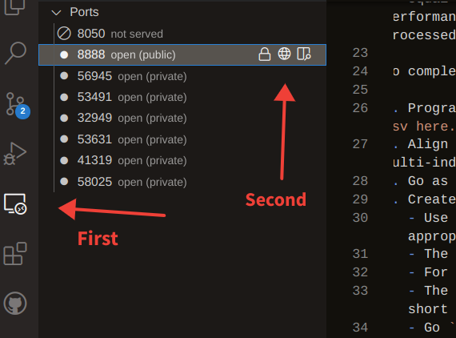

# Quant. Finance Coding Test

This should be a straightforward experience for creating a standardized development environment to perform quantiative analysis work. After creating the necessary accounts, it is expected that this work can be completed in under two hours.

## Usage and test structure

To start you will need to create two accounts, in addition to a github account.

1. [gitpod.io](https://gitpod.io), for the devleopment environment.
2. [IEXcloud.io](https://iexcloud.io/), for the price data.

After you've created the Gitpod account, you can open up the development environment by clicking here:

[](https://gitpod.io/#https://github.com/wmacmillan/quant-coding-test)

A Jupyter notebook server has been automatically spawned when the IDE is launched. You can access it by clicking remote explorer on the left hand side context menu, which will open up the available ports. From there click on the globe icon for port 8888. This will open the server in a tab in your browser. See the screenshot below for the specific icons discussed. The password for the Jupyter server is `financerocks!`. All libraries you might need to complete this task should be installed already in this environment and be accesable in Jupyter.

**You will want to fork this repository and/or pin the environment in the [gitpod dashboard](gitpod.io) to avoid losing your work if you step away from the browser and the environment times out.**

## Coding task

You are going to estimate log cumulative daily returns from an "equal weighting" and a "equal weight, long/short, sector rotation" pair of strategies. The actual performance of the strategies is immaterial; the intent is to see how the data is processed and manipulated and whether you arrive at the appropriate end point.

To complete this test, you must:

1. Programtically get the current set of constituents of the S&P 500, [available as a csv here.](https://datahub.io/core/s-and-p-500-companies/r/constituents.csv).
2. Align daily price data from IEXcloud to these, to create a Pandas dataframe with a multi-index of `Date`, `Symbol` and `Sector`, with the columns as OHLC(V). `pyEX` is a convenient library for this.
3. Go as far back in time as you can for every stock in the sectors noted below.
4. Create returns.
   - Use the [function](#Returns_function) included below. Close price, in an appropriately structured pandas dataframe, will return the results needed.
   - The "equal weight" part of the strategy is to hold a single unit of each stock.
   - For the long-only, equal weight, use the `Industrials` sector.
   - The aggregate return from the L-S strategy is the sum of the separate long and short strategies.
   - Go `Health Care` long, `Consumer Discretionary` short.
5. Plot the returns.
6. Calculate the Sharpe, Sortino, and Information Ratio statistics.
   - Dummy information can be used for the RFR or other necesssary data.

After completing the follow, submit a pull request back to this repository, and you're done. Godspeed.

#### Returns function

```python
import pandas as pd
from numpy import log

def make_ret(df, long: bool=True) -> pd.Series:
    """Generates returns.

    Args:
        df (Pandas Dataframe or Series): A series or dataframe of daily close prices.
        long (bool, optional): True indicates long-only, False is for short-only. Defaults to True.
        
    Returns:
        pd.Series: cumulative daily returns, from logged daily close prices.
    """    
    
    if long:
        sign = 1
    else:
        sign = -1

    ret = (
        sign*log(df)
        .groupby(level=1)
        .diff()
        .groupby(level=0)
        .mean()
        .cumsum()
    )
    return ret
```

### Screenshot for Jupyter Notebook Server



If you run into any issues, email the maintainer, Bill MacMillan, at `bill at macmillan dot co`.
